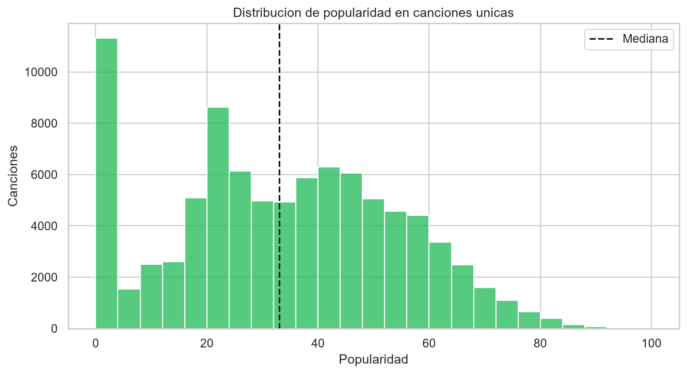
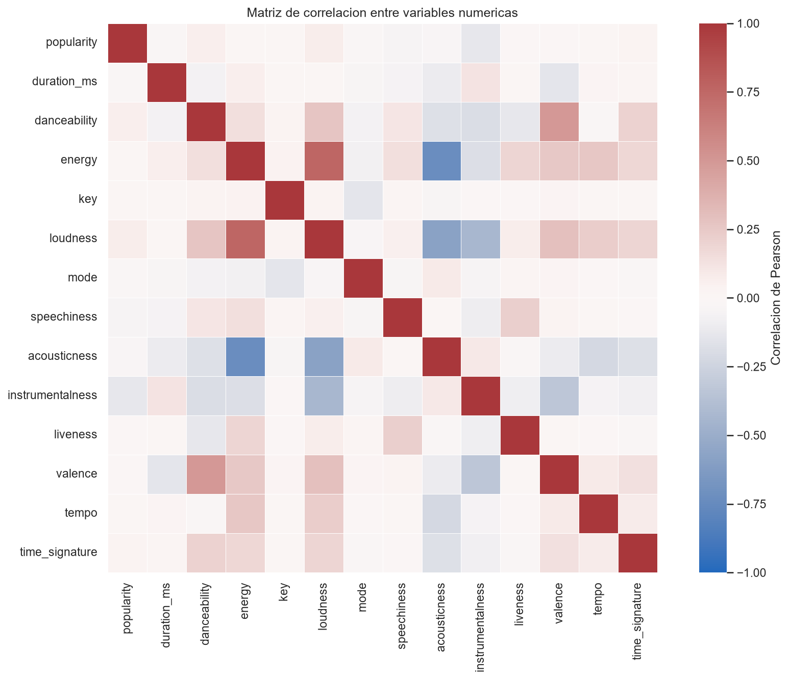
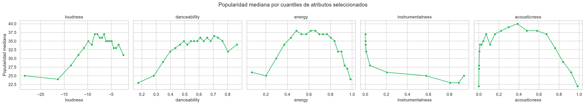
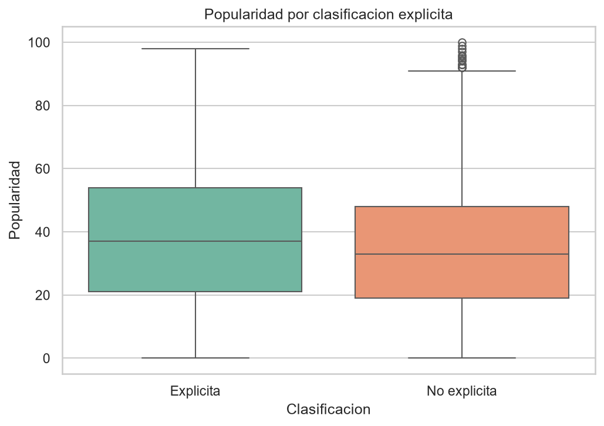
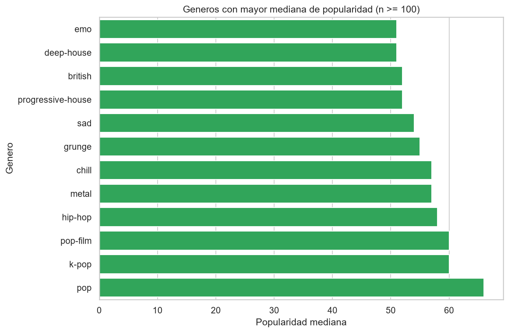
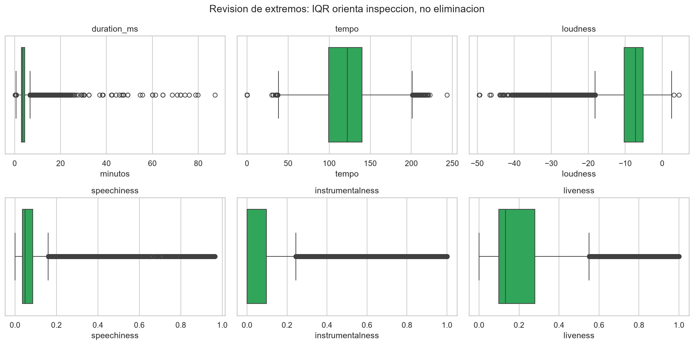

# Spotify Popularity Analysis

Proyecto académico de análisis de datos y Machine Learning orientado a estudiar qué
características musicales y contextuales están asociadas con la popularidad de canciones en
Spotify. El trabajo sigue la metodología CRISP-DM y prioriza la trazabilidad, la calidad de
datos, el análisis exploratorio y la reproducibilidad exigidos en la Evaluación Parcial 1.

## Problema y propósito del proyecto

Artistas, sellos, equipos de marketing y curadores de contenido deben decidir qué canciones
priorizar sin conocer completamente su desempeño futuro. El proyecto busca aportar evidencia
para esas decisiones mediante la siguiente pregunta de negocio:

> ¿Qué características musicales y contextuales están asociadas con la popularidad de una
> canción y cómo puede esta información apoyar decisiones de promoción y gestión de catálogo?

El objetivo general es analizar la relación entre los atributos disponibles y `popularity`,
además de preparar una base confiable para evaluar posteriormente modelos de regresión. El
análisis identifica asociaciones y patrones; no pretende demostrar relaciones causales.

Los objetivos específicos del equipo son:

1. Comprender el contexto de negocio, los usuarios del análisis y sus necesidades.
2. Examinar la estructura, procedencia y calidad del dataset.
3. Preparar los datos con decisiones justificadas y reproducibles.
4. Explorar patrones, relaciones, anomalías y posibles sesgos.
5. Evaluar variables y modelos pertinentes para estimar popularidad.
6. Comunicar resultados, limitaciones y consideraciones éticas de forma defendible.

## Dataset

El archivo de trabajo fue proporcionado por la asignatura y se conserva sin modificaciones
en `data/raw/Spotify_Tracks_Dataset.csv`. Su estructura coincide con el
[Spotify Tracks Dataset publicado en Kaggle](https://www.kaggle.com/datasets/maharshipandya/-spotify-tracks-dataset),
atribuido a Maharshi Pandya y construido con metadatos y características de Spotify.

La variable de interés es `popularity`, medida en una escala de 0 a 100. La
[documentación de Spotify](https://developer.spotify.com/documentation/web-api/reference/get-track)
indica que esta medida depende principalmente de reproducciones y recencia; actualmente el
campo aparece como obsoleto en la API. Por ello, el dataset se interpreta como una fotografía
histórica y no como información en tiempo real.

El archivo contiene 114.000 filas y 21 columnas antes de cualquier transformación. Su
integridad se controla con SHA-256:

```text
b202fa49909b2d5cef71a04b1d21243cfeb36414535f2ca9272aa646721177bd
```

El significado, tipo y rol esperado de cada campo se encuentra en el
[diccionario de variables](docs/data_dictionary.md).

## Indicadores de evaluación

El proyecto separa los indicadores descriptivos, de calidad y de desempeño predictivo para
evitar confundir éxito de negocio con precisión técnica.

| Categoría | Indicador | Uso previsto |
|---|---|---|
| Negocio | Popularidad promedio y mediana | Caracterizar el desempeño central del catálogo observado. |
| Negocio | Proporción con popularidad ≥ 70 | Explorar un segmento operativo de alta popularidad; el umbral requiere análisis de sensibilidad. |
| Negocio | Popularidad por género | Comparar segmentos sin interpretar diferencias como efectos causales. |
| Calidad | Completitud | Cuantificar la disponibilidad de los datos. |
| Calidad | Duplicidad de `track_id` | Prevenir conteos sesgados y futura fuga entre entrenamiento y prueba. |
| Modelo | MAE, RMSE y R² | Evaluar el error y la capacidad explicativa de modelos de regresión. |

## Metodología y estado

CRISP-DM se aplica de manera iterativa: un hallazgo de preparación, modelamiento o evaluación
puede exigir revisar decisiones anteriores.

| Fase CRISP-DM | Aplicación en el proyecto | Estado |
|---|---|---|
| Business Understanding | Problema, stakeholders, objetivos e indicadores. | Completada inicialmente. |
| Data Understanding | Fuente, variables, estructura, calidad preliminar y primeras distribuciones. | Completada inicialmente. |
| Data Preparation | Tratamiento del índice exportado, nulos, anomalías y repetición de `track_id`. | Completada inicialmente. |
| Modeling | Comparación de regresiones y alternativas justificadas. | Pendiente. |
| Evaluation | Métricas técnicas, utilidad de negocio, sesgos y limitaciones. | Pendiente. |
| Deployment | Informe, notebooks, datos y presentación reproducibles. | En construcción. |

### Entregables y responsables

| Entregable | Alcance | Responsable | Estado |
|---|---|---|---|
| [`01_data_understanding.ipynb`](notebooks/01_data_understanding.ipynb) | Problema, objetivos, KPIs, fuente, CRISP-DM, descripción de variables, inspección inicial y primeras distribuciones. | Lucas Moncada | Completado. |
| [Registro de avance de Lucas Moncada](docs/progress/lucas_moncada.md) | Decisiones, resultados verificados y entrega de hallazgos para la preparación de datos. | Lucas Moncada | Completado. |
| [`02_data_preparation.ipynb`](notebooks/02_data_preparation.ipynb) | Limpieza reproducible, tratamiento de anomalías, nulos y `track_id`, validación, transformaciones y construcción documentada del dataset procesado. | Ignacio Silva | Completado. |
| [Registro de avance de Ignacio Silva](docs/progress/ignacio_silva.md) | Checkpoints, decisiones, validaciones y entrega documentada de la etapa de calidad. | Ignacio Silva | Completado. |
| [`03_exploratory_analysis.ipynb`](notebooks/03_exploratory_analysis.ipynb) | EDA profundo de popularidad, relaciones, anomalías, sesgos, ética, privacidad y recomendaciones para modelamiento. | César Rojas | Completado inicialmente. |
| [Registro de avance de César Rojas](docs/progress/cesar_rojas.md) | Validaciones, hallazgos, decisiones de EDA y entrega documentada a modelamiento. | César Rojas | Completado inicialmente. |
| Modelamiento y evaluación | Línea base, modelos y métricas predictivas. | Equipo | Pendiente. |

Esta tabla se actualizará cuando el equipo incorpore nuevas etapas; no se crean enlaces a
archivos que todavía no existen.

## Resultados disponibles

La comprensión inicial confirmó:

- 114.000 registros y 21 variables.
- 3 celdas nulas, concentradas en una misma fila anómala.
- 0 filas exactamente duplicadas.
- 89.741 valores únicos de `track_id`.
- 16.641 IDs repetidos, asociados a 40.900 filas.
- 114 géneros con 1.000 registros cada uno.
- Popularidad media de 33,24 y mediana de 35.
- 14,05% de los registros con popularidad 0 y 4,8% con popularidad igual o superior a 70.

Estos resultados describen las filas observadas. Antes de formular conclusiones por canción o
dividir datos para modelamiento, debe resolverse la repetición de `track_id`.

## Preparación de datos disponible

La etapa 2 genera `data/processed/spotify_tracks_clean.csv` de forma reproducible con:

- Eliminación de `Unnamed: 0`, que solo reproduce el índice exportado.
- Exclusión de 1 registro sin artista, álbum ni nombre de pista, y con duración cero.
- Consolidación de 24.259 apariciones adicionales de `track_id`; cada canción queda una vez.
- Conservación de las etiquetas múltiples de género en `track_genres`, ordenadas y separadas
  por `|`.
- Uso de la mediana de `popularity` cuando un mismo ID tiene valores distintos, evitando
  elegir arbitrariamente una de sus asignaciones de género.

El resultado contiene 89.740 canciones, 20 columnas, ningún valor nulo y duración positiva.
Las decisiones, sus controles y las limitaciones se registran en el
[checkpoint de preparación](docs/progress/ignacio_silva.md). Para regenerarlo:

```powershell
uv run python scripts/build_processed_dataset.py
```

## EDA profundo disponible

El [notebook de EDA](notebooks/03_exploratory_analysis.ipynb) usa exclusivamente el dataset
procesado y valida su contrato antes de analizarlo. Sus principales hallazgos son:

- Popularidad media 33,20 y mediana 33; 10,47% de canciones con valor cero y 3,48% con 70 o más.
- Ningún atributo acústico aislado tiene asociación fuerte con popularidad; `instrumentalness`
  presenta la asociación negativa más visible.
- `energy`, `loudness` y `acousticness` muestran redundancia relevante para modelos lineales.
- El análisis documenta los sesgos de género y temporalidad, riesgos éticos y de privacidad, y la
  recomendación de usar modelos como apoyo a decisiones humanas.

El detalle de decisiones, limitaciones y traspaso se encuentra en el
[registro de César Rojas](docs/progress/cesar_rojas.md).

### Comparación antes y después de la preparación

| Dataset | Filas | Canciones únicas | Media | Mediana | Popularidad = 0 | Popularidad ≥ 70 |
|---|---:|---:|---:|---:|---:|---:|
| Original | 114.000 | 89.741 | 33,239 | 35 | 14,053% | 4,800% |
| Procesado | 89.740 | 89.740 | 33,198 | 33 | 10,468% | 3,480% |

La reducción de filas no equivale a perder 24.260 canciones: se consolidan apariciones del mismo
`track_id` asociadas a diferentes géneros y se retira una fila inválida. La media cambia poco,
pero la mediana y las proporciones extremas sí cambian. Esto demuestra que la repetición por género
alteraba la ponderación de la distribución original.



*Figura 5. Distribución de `popularity` sobre 89.740 canciones únicas. La concentración en valores
bajos y medios debe considerarse al definir líneas base y evaluar errores por segmentos.*

La popularidad procesada tiene media 33,20, mediana 33 y desviación estándar 20,58. Los percentiles
25, 75 y 95 son 19, 49 y 67. Los valores 0 y 100 pertenecen al rango documentado, por lo que no se
consideran errores únicamente por estar en los extremos.

### Relaciones numéricas con `popularity`

Pearson resume asociación lineal, mientras Spearman resume asociación monotónica a partir de
rangos. Ambas medidas describen asociación y no causalidad.

| Variable | Pearson | Spearman |
|---|---:|---:|
| `instrumentalness` | -0,127 | -0,124 |
| `loudness` | 0,072 | 0,067 |
| `speechiness` | -0,047 | -0,067 |
| `danceability` | 0,064 | 0,055 |
| `energy` | 0,014 | -0,016 |
| `duration_ms` | -0,023 | 0,013 |
| `liveness` | -0,014 | -0,012 |
| `valence` | -0,012 | -0,011 |
| `acousticness` | -0,039 | 0,010 |
| `tempo` | 0,007 | 0,008 |

Ninguna característica acústica individual presenta una asociación fuerte. `instrumentalness`
muestra la señal negativa de mayor magnitud; `loudness` y `danceability` tienen asociaciones
positivas pequeñas. Una correlación cercana a cero tampoco descarta relaciones no lineales,
interacciones o diferencias entre géneros.



*Figura 6. Matriz de Pearson. Las relaciones más intensas aparecen entre predictores de audio, no
entre un predictor individual y la variable objetivo.*

Las principales redundancias son `energy`–`loudness` (0,759), `energy`–`acousticness` (-0,733) y
`loudness`–`acousticness` (-0,583). En modelos lineales esto puede volver inestables los coeficientes;
se recomienda evaluar escalamiento, regularización y, si el objetivo es explicativo, diagnósticos
como VIF sobre la matriz de diseño definitiva.

### Relaciones bivariadas

Un scatterplot con casi 90 mil puntos produciría sobreposición. Por ello se dividieron variables
seleccionadas en cuantiles y se representó la mediana de popularidad por intervalo.



*Figura 7. Tendencias por cuantiles de cinco atributos. Permiten observar curvaturas que una
correlación global no representa.*

La caída asociada con `instrumentalness` es la tendencia más consistente. `loudness` y
`danceability` crecen en parte de su rango, mientras `energy` y `acousticness` presentan formas
curvas. Estos patrones justifican evaluar relaciones no lineales, pero no constituyen reglas para
modificar canciones ni demuestran efectos causales.

### Contenido explícito y relevancia práctica

| Grupo | Canciones | Media | Mediana | Desviación estándar |
|---|---:|---:|---:|---:|
| No explícita | 82.036 | 32,852 | 33 | 20,369 |
| Explícita | 7.704 | 36,884 | 37 | 22,352 |

La diferencia es 4,032 puntos en media y 4 puntos en mediana. Sin embargo, el tamaño de efecto
estandarizado es pequeño (`d` de Cohen = 0,196). Con una muestra grande una diferencia puede ser
estadísticamente detectable sin ser grande en términos prácticos.



*Figura 8. Los grupos presentan centros diferentes, pero también un solapamiento amplio. No se
puede concluir que el contenido explícito produzca mayor popularidad.*

### Géneros como variable multietiqueta

`track_genres` puede contener varias etiquetas separadas por `|`. Para resumir popularidad se
expande una canción por cada etiqueta, pero esas filas expandidas no representan canciones nuevas.
Los conteos se realizan sobre `track_id` únicos dentro de cada género.



*Figura 9. Géneros con mayor mediana entre aquellos con soporte suficiente. Los resultados describen
la muestra y no la prevalencia real del catálogo de Spotify.*

| Soporte mínimo | Géneros incluidos | Género con mayor mediana | Mediana |
|---:|---:|---|---:|
| 100 | 114 | `pop` | 66 |
| 200 | 114 | `pop` | 66 |
| 500 | 114 | `pop` | 66 |

La conclusión principal es estable ante esos tres umbrales porque todos los géneros poseen soporte
cercano a mil canciones. Esta estabilidad no elimina el sesgo de muestreo artificialmente
balanceado ni permite afirmar que un género cause popularidad.

### Valores extremos y anomalías

El criterio IQR se utiliza como señal de revisión, no como regla automática de eliminación.

| Variable | Mínimo | P1 | P99 | Máximo | Casos fuera de IQR |
|---|---:|---:|---:|---:|---:|
| `duration_ms` | 8.586 | 61.872 | 546.011 | 5.237.295 | 4.225 |
| `tempo` | 0 | 65,165 | 193,652 | 243,372 | 514 |
| `loudness` | -49,531 | -28,542 | -1,628 | 4,532 | 5.026 |
| `speechiness` | 0 | 0,025 | 0,619 | 0,965 | 10.644 |
| `instrumentalness` | 0 | 0 | 0,958 | 1 | 19.613 |
| `liveness` | 0 | 0,041 | 0,950 | 1 | 6.981 |



*Figura 10. Las colas y concentraciones dependen de la naturaleza de cada atributo. Estar fuera del
IQR no demuestra un error de datos.*

La duración máxima equivale aproximadamente a 87,29 minutos y puede representar contenido largo
válido. `tempo=0` merece validación puntual, pero no se elimina sin evidencia adicional. Las
acumulaciones extremas en `speechiness`, `instrumentalness` y `liveness` son compatibles con
variables acotadas y asimétricas. Para modelamiento se sugiere comparar escalamiento robusto y una
transformación `log1p` de duración.

## Variables recomendadas para modelamiento

| Variable o grupo | Clasificación | Evidencia o riesgo | Recomendación |
|---|---|---|---|
| `popularity` | Target | Histórica, dinámica y con masa en cero | Regresión; evaluar errores en distintos rangos |
| Atributos acústicos | Candidatas | Señales individuales débiles y posibles interacciones | Evaluar conjuntamente y escalar según el modelo |
| `duration_ms`, `tempo`, `loudness` | Requieren tratamiento | Colas y extremos | Comparar transformación y escala robusta |
| `explicit` | Candidata binaria | Efecto descriptivo pequeño y posible confusión | Incluir con auditoría por grupos |
| `track_genres` | Requiere encoding | Multietiqueta y muestra balanceada | Aplicar multi-hot encoding |
| `key`, `mode`, `time_signature` | Requieren encoding | Categorías representadas numéricamente | No tratarlas automáticamente como distancias continuas |
| `artists` | Alta cardinalidad | 31.437 valores; riesgo de memorizar reputación | Excluir de línea base o validar por artista |
| `album_name` | Alta cardinalidad | 46.589 valores; riesgo de memorización | Excluir de línea base |
| `track_name` | Alta cardinalidad | 73.608 valores y texto libre | Excluir de línea base |
| `track_id` | Excluir | Identificador único y riesgo directo de leakage | Mantener solo para trazabilidad |

Las asociaciones individuales débiles no significan que un modelo multivariable sea necesariamente
inútil: una combinación de variables, interacciones o curvaturas podría aportar señal. Esa utilidad
debe demostrarse fuera de muestra frente a una línea base.

## Sesgos identificados

### Sesgo de muestreo

El dataset original contiene exactamente 1.000 filas por género. Esto no representa la frecuencia
natural de canciones ni de reproducciones en Spotify. Además, antes de consolidar, las canciones
con varias etiquetas tenían mayor peso en los agregados.

### Sesgo temporal

`popularity` depende de reproducciones y recencia, pero no existe fecha de extracción ni fecha de
lanzamiento. El dataset es una fotografía histórica y puede sufrir *concept drift*: las relaciones
aprendidas podrían cambiar con tendencias, audiencias o reglas de la plataforma.

### Variables omitidas

No se observan inversión de marketing, exposición en playlists, viralidad, popularidad previa del
artista, colaboraciones, región, fecha de lanzamiento, estacionalidad ni exposición externa. Estas
ausencias limitan tanto la predicción como cualquier interpretación causal.

### Sesgo por artista y género

Una partición aleatoria puede dejar canciones del mismo artista en entrenamiento y prueba, haciendo
que el modelo memorice reputación en vez de generalizar a artistas nuevos. Los géneros tampoco son
grupos excluyentes: una canción puede pertenecer a varias etiquetas y debe evaluarse como tal.

## Ética y uso responsable

Una predicción de popularidad podría reforzar artistas que ya reciben exposición, favorecer estilos
dominantes, reducir oportunidades para artistas emergentes o convertir correlaciones históricas en
reglas creativas. Tampoco debe confundirse popularidad estimada con mérito o calidad artística.

El uso responsable requiere:

- Tratar el modelo como apoyo a la decisión humana, no como criterio único.
- Informar incertidumbre, procedencia y límites de generalización.
- Revisar errores por género, contenido explícito y artistas vistos o no vistos.
- Monitorear cambios temporales y degradación del desempeño.
- Evitar asignaciones automáticas de presupuesto o promoción de alto impacto.
- Preservar diversidad y permitir revisión de las decisiones.

## Privacidad

El dataset contiene metadatos de canciones, nombres públicos de artistas y atributos musicales. No
incluye directamente identidad, ubicación, perfiles ni historial de escucha de oyentes, por lo que
el riesgo de privacidad individual es relativamente bajo frente a datasets de comportamiento.

Esto no elimina la obligación de conservar trazabilidad, respetar condiciones de uso y aplicar
minimización. Si en el futuro se integran playlists personales, ubicaciones o eventos de escucha,
serán necesarios controles de acceso, retención limitada, evaluación de reidentificación y una base
legal claramente definida.

## Matriz de riesgos técnicos

| Riesgo | Impacto | Probabilidad | Mitigación |
|---|---|---|---|
| Leakage mediante `track_id` | Alto | Alta si se incluye | Excluir del conjunto predictor |
| Memorización por artista | Alto | Alta | Validación agrupada y control de encoding |
| Drift temporal | Alto | Alta | Obtener fechas y validar hacia adelante |
| Muestra no representativa | Alto | Alta | Limitar generalización y documentar cobertura |
| Variables contextuales omitidas | Alto | Alta | Incorporar contexto trazable sin afirmar causalidad |
| Multicolinealidad acústica | Medio | Alta | Escalamiento, regularización y diagnóstico |
| Géneros multietiqueta | Medio | Alta | Multi-hot encoding y métricas no excluyentes |
| Extremos válidos tratados como errores | Medio | Media | Validación puntual y análisis de sensibilidad |
| Desempeño desigual por segmentos | Alto | Media | Reportar métricas globales y por grupos |
| Sobreconfianza de negocio | Alto | Media | Supervisión humana y límites de uso |

Estas probabilidades e impactos son categorías cualitativas para priorizar controles, no frecuencias
estadísticas estimadas.

## Entrega a modelamiento

La siguiente etapa recibe 89.740 canciones únicas y debe:

1. Establecer una línea base que prediga la mediana.
2. Construir las transformaciones dentro de un pipeline ajustado solo con entrenamiento.
3. Excluir `track_id` y evaluar con cuidado las variables de alta cardinalidad.
4. Usar multi-hot encoding para `track_genres`.
5. Comparar regresión lineal y regularizada antes de aumentar complejidad.
6. Medir MAE, RMSE y R² fuera de muestra.
7. Complementar una partición aleatoria con validación agrupada por artista.
8. Preferir una partición temporal si se obtienen fechas.
9. Reportar resultados y errores por segmentos, no solo una métrica global.

MAE expresa el error promedio en puntos de popularidad; RMSE penaliza más los errores grandes; R²
compara la variabilidad explicada con una referencia. Ninguna de estas métricas demuestra causalidad,
equidad ni utilidad operativa por sí sola.

## Conclusiones operativas

El proyecto demuestra que la popularidad observada no se explica mediante una regla acústica
simple. `instrumentalness`, `loudness` y `danceability` contienen señales descriptivas pequeñas,
mientras los géneros muestran diferencias que deben interpretarse bajo un muestreo artificial y
multietiqueta. Factores probablemente importantes —promoción, playlists, región, recencia y
reputación previa— no están disponibles.

Una futura predicción podría ayudar a priorizar revisiones, comparar segmentos o detectar casos que
requieren más contexto. No puede garantizar éxito ni decidir por sí sola qué obra merece inversión.
La decisión final debe combinar evidencia cuantitativa, conocimiento del mercado, objetivos
creativos y supervisión humana.

## Documentación técnica complementaria

El [informe LaTeX extendido](docs/latex/README.md) consolida el desarrollo, las decisiones,
la robustez estadística, los riesgos y una guía de defensa. Complementa este README y los
notebooks, que siguen siendo las fuentes oficiales de resumen y evidencia ejecutable. Su versión
compilada está disponible en [`output/pdf/main.pdf`](output/pdf/main.pdf).

## Instalación reproducible

### Requisitos

- [uv](https://docs.astral.sh/uv/)
- Git

El proyecto fija Python 3.12 y las versiones exactas de sus dependencias en `uv.lock`. Desde
la raíz del repositorio:

```powershell
uv sync
```

No es necesario activar `.venv` manualmente: `uv run` ejecuta cada comando dentro del entorno
del proyecto.

## Ejecución y verificación

```powershell
# Abrir los notebooks
uv run jupyter lab

# Generar la base intermedia sin modificar el archivo original
uv run python scripts/build_base_dataset.py

# Generar el dataset limpio de una canción por track_id
uv run python scripts/build_processed_dataset.py

# Regenerar las tablas estadísticas del informe extendido
uv run python scripts/build_latex_tables.py

# Verificar estilo y pruebas automatizadas
uv run ruff check .
uv run ruff format --check .
uv run pytest
```

Los notebooks se ejecutan en orden numérico. La lógica reutilizable se mantiene en `src/` y
las celdas se concentran en la narrativa, las llamadas al paquete y la interpretación de
resultados.

## Flujo de datos

```text
data/raw/
    │  datos originales e inmutables
    ▼
data/interim/
    │  resultados intermedios regenerables
    ▼
data/processed/
    │  datos preparados para análisis y modelamiento
    ├──────────────► reports/figures/
    └──────────────► models/
```

Las transformaciones deben implementarse en `src/spotify_popularity/`, exponerse mediante
scripts o notebooks y acompañarse de pruebas cuando contengan reglas reutilizables.

## Estructura del repositorio

```text
.
├── data/
│   ├── raw/                    # Datos originales, inmutables
│   ├── interim/                # Resultados intermedios regenerables
│   └── processed/              # Datos preparados para análisis/modelamiento
├── docs/
│   ├── progress/               # Registro de avances y traspasos
│   ├── reference/              # Rúbrica y documentación de origen
│   ├── latex/                  # Informe técnico extendido y tablas reproducibles
│   └── data_dictionary.md      # Diccionario del dataset
├── models/                     # Modelos serializados generados
├── notebooks/                  # Análisis numerados en orden de ejecución
├── reports/figures/            # Figuras para informe y presentación
├── output/pdf/                 # Informe técnico compilado
├── scripts/                    # Puntos de entrada ejecutables
├── src/spotify_popularity/
│   ├── config.py               # Configuración transversal
│   ├── data/                   # Carga, esquema, metadatos e integridad
│   ├── analysis/               # Calidad y análisis descriptivo
│   └── visualization/          # Distribuciones y estilo visual
├── tests/                      # Pruebas automatizadas
├── COLLABORATORS.md            # Flujo de colaboración y GitFlow
├── pyproject.toml              # Dependencias y herramientas
└── uv.lock                     # Resolución exacta de dependencias
```

## Colaboración

El repositorio utiliza un GitFlow simplificado:

- `main` contiene hitos estables.
- `dev` integra cambios revisados.
- `feature/*`, `fix/*` y `hotfix/*` contienen tareas acotadas.

Los commits, Pull Requests y documentación se redactan en español; los nombres técnicos de
GitFlow permanecen en inglés. Las reglas completas de ramas, notebooks, datos, validación e
integración están en la [guía de colaboración](COLLABORATORS.md).

## Limitaciones actuales

- El dataset es estático y no representa el estado actual de Spotify.
- `popularity` depende de factores temporales y comerciales que no están completamente
  representados en las variables disponibles.
- La fuente original repetía `track_id`; el dataset procesado ya representa una canción por fila,
  pero conserva la pertenencia multietiqueta en `track_genres`.
- La cobertura original perfectamente balanceada por género no representa la composición natural
  del catálogo ni la distribución de reproducciones.
- No existen fechas, regiones, exposición en playlists, inversión promocional ni comportamiento de
  oyentes para controlar esos factores.
- Los resultados descriptivos no permiten afirmar causalidad.
- La preparación, el EDA y el análisis de sesgos, ética y privacidad están completados inicialmente;
  el modelamiento y la evaluación fuera de muestra siguen pendientes.
